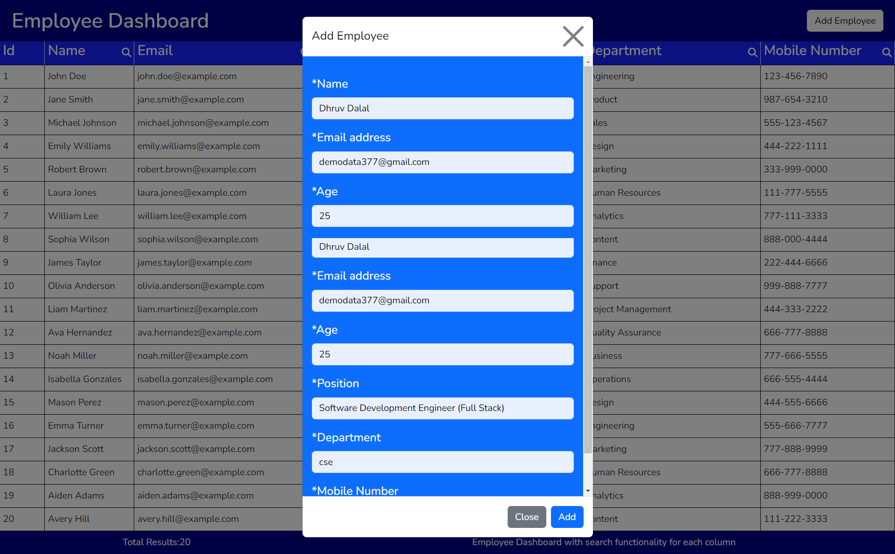
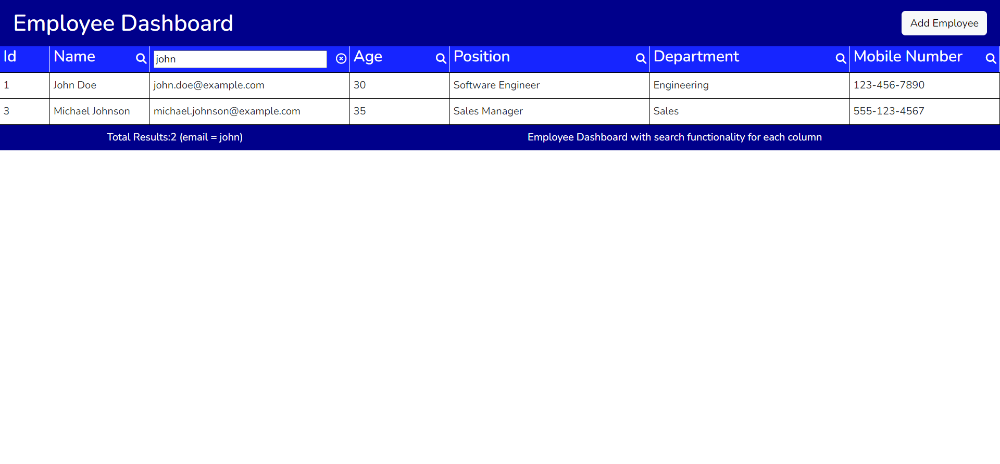

# Employee Dashboard
   

   # live Demo :- [Employee DashBoard ↗️](https://empdashboard.netlify.app/)

   #  code :- [Employee Dashboard](https://github.com/dhruv2442/Emp_DashBoard)

Welcome to the Employee Dashboard! This web page provides you with the functionalities to manage employees efficiently. Below are the main features of the Employeedashboard:

## Functionalities

1. **Add Employee**
   - Click on the "Add Employee" button to open a form where you can input details of a new employee.
   - Fill in the required information such as name, email, position, etc.
   - Submit the form to add the new employee to the dashboard.
   

2. **Search on Every Column**
   - In the header of every column in the employee table, you will find search boxes.
   - Type the keyword you want to search for in any column.
   - The dashboard will automatically filter the employees based on your search query and display the matching results.
   

